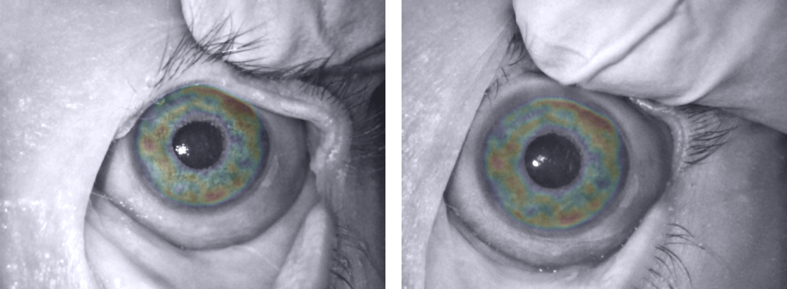

# Iris recognition designed for post-mortem and diseased eyes

This software package demonstrates how to combine selected efforts aimed at delivering effective iris recognition methods for diseased eyes and post-mortem samples (collected after death). The following codes and models were merged here into a complete iris recognition software package:

a) segmentation and normalization (SegNet-based Matlab codes):
> Mateusz Trokielewicz, Adam Czajka, Piotr Maciejewicz, “Post-mortem iris recognition with deep learning-based image segmentation,” Image and Vision Computing, Vol. 94 (103866), Feb. 2020, pp. 1-11; pre-print: https://arxiv.org/abs/1901.01708

b) segmentation and normalization (CCNet-based Python codes):
> Suraj Mishra, Adam Czajka, Peixian Liang, Danny Z. Chen, X. Sharon Hu, “CC-Net: Image Complexity Guided Network Compression for Biomedical Image Segmentation,” The IEEE Int. Symposium on Biomedical Imaging (ISBI), Venice, Italy, April 8-11, 2019; pre-print available at https://arxiv.org/abs/1901.01578

> Zhaoyuan Fang and Adam Czajka, “Open Source Iris Recognition Hardware and Software with Presentation Attack Detection,” The IEEE/IAPR International Join Conference on Biometrics (IJCB 2020), Sept. 28 – Oct. 1, 2020, Houston, USA; pre-print: https://arxiv.org/abs/2008.08220

c) human-driven BSIF-based iris pattern encoding:
> Adam Czajka, Daniel Moreira, Kevin W. Bowyer, Patrick Flynn, “Domain-Specific Human-Inspired Binarized Statistical Image Features for Iris Recognition,” The IEEE Winter Conference on Applications of Computer Vision, Waikoloa Village, Hawaii, January 7-11, 2019; pre-print: https://arxiv.org/abs/1807.05248

# How to

## Matlab:
Simply run / analyze `howto.m` (tested with Matlab 2019b -- 2020b) to have fun.

## Python: 
1. Install dependecies:

```bash
conda env create -f ccnet.yaml
```

2. Run / analyze:
* `howto.py`, which - as an example - encodes and matches three post-mortem samples from the Warsaw dataset
* `howto_pair_with_visualization.py`, which demonstrates how to match a pair of images and get visualizations annotating salient regions within iris annulus

* You can run `howto_mccnet.py` and `howto_pair_with_visualization_mccnet.py` to do the same but with the modified CC-Net architecture that estimates the pupil and iris circle parameters as well.




# Database

The Warsaw datasets of post-mortem iris images (acquired from 79 cadavers in total) can be requested at http://zbum.ia.pw.edu.pl/EN/node/46. Warsaw post-mortem iris datasets are freely available for non-commercial purposes to all interested researchers.

# Troubleshooting

If you have problems with the `.mat` and `.pth` files:

* use `git-lfs clone` instead of `git clone`, OR
* download the [models and filters from this Google Drive location](https://drive.google.com/drive/folders/1pyifeABdRUQZWfjMEB0f0ye8h1K2qNDO?usp=sharing)

# License

This is a research open-source software. You are free to use it in your research projects. Please discuss individual licensing options if you want to use this software for commercial purposes, or to create and distribute closed source versions.
